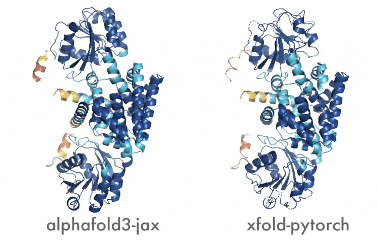

# xfold: Democratize AlphaFold3

xfold is an open-source, PyTorch-based reimplementation of AlphaFold3, designed to accelerate protein structure prediction research and make cutting-edge AI technology more accessible to the scientific community.

Future developments for xfold will focus on integrating cutting-edge performance optimization techniques and advanced parallelization strategies. Our ultimate goal is to democratize AlphaFold3, empowering a broader researcher to contribute to and benefit from this transformative technology.

<div align="center">
    
    <p><em>Visualization result comparison of 2pv7</em></p>
</div>

## Recent Developments 🚀

* **December 2024**: Successful migration to PyTorch, with validation confirming alignment with the original implementation

## Getting Started

### Step 1: Prepare the Environment

Follow the setup instructions provided in the [AlphaFold3 README](https://github.com/google-deepmind/alphafold3) to ensure dependencies are correctly installed and the AlphaFold 3 model parameters are downloaded.

### Step 2: Install xfold

Install xfold using pip:

```bash
pip install xfold
```

### Step 3: Running Predictions

Execute protein structure predictions with the following command:

```bash
python run_alphafold.py \
    --db_dir=$PATH_TO_AF3_DATASET \
    --json_path=./fold_input.json \
    --model_dir=$$PATH_TO_AF3_MODEL \
    --output_dir=./output
```

## Acknowledgments

The xfold source code is licensed under the Apache License, Version 2.0.

This project may include code adapted from or inspired by AlphaFold 3 source code, which is licensed under Apache-2.0.

AlphaFold 3 model parameters/weights are not included in this repository and are subject to Google DeepMind's separate AlphaFold 3 Model Parameters Terms of Use. Users are kindly requested to review and comply with the AlphaFold3 license, available at https://github.com/google-deepmind/alphafold3?tab=readme-ov-file#licence-and-disclaimer.

## Contributing

We welcome contributions from the research community! Open an [issue](https://github.com/shenggan/xfold/issues) or send a [pull request](https://github.com/shenggan/xfold/pulls).
